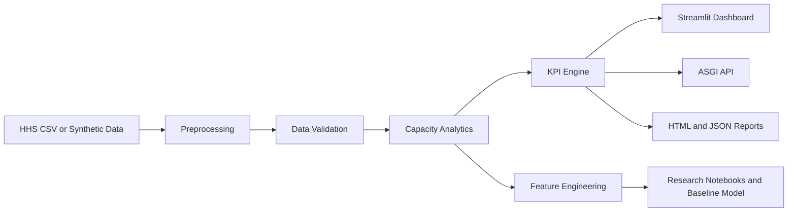

# System Capacity & Care Load Analytics for Unaccompanied Children


An end-to-end data engineering and analytics application for monitoring system capacity, care load, intake pressure, discharge performance, and backlog accumulation for unaccompanied children in CBP and HHS care.

The project combines a production-style Python analytics backend, data-quality validation, feature engineering, KPI calculation, report generation, a multipage Streamlit dashboard, and an ASGI API.

> **Important:** This project is an independent research and decision-support prototype. It is not an official HHS or CBP application, forecast, publication, or operational system.

---

## Problem Statement

Daily transfers, discharges, and active-care populations interact across the CBP and HHS care systems. Reviewing individual daily counts alone makes it difficult to identify:

- Increasing system pressure
- Persistent intake backlogs
- Changes in discharge performance
- Care-load volatility
- Capacity utilization risk
- Data-quality problems
- Long-term and seasonal patterns

This project transforms daily aggregate counts into validated, decision-support metrics and interactive analytical views.

---

## Key Features

### Data engineering

- CSV ingestion with schema validation
- Automatic date parsing and chronological ordering
- Missing-date detection and daily-series reconstruction
- Missing-value imputation with audit flags
- Duplicate, negative-value, and logical-anomaly detection
- Reproducible raw and processed data artifacts
- CSV, JSON, and Parquet output formats

### Capacity analytics

- Total System Load
- Net Daily Intake
- Care Load Growth Rate
- 7-day and 14-day moving averages
- Discharge Offset Ratio
- Backlog streak and episode detection
- CBP and HHS care-load comparison
- Capacity utilization and headroom scenarios
- Daily, weekly, and monthly aggregation

### Dashboard

- Professional slate/navy government-analytics theme
- Configurable reporting period
- Daily, weekly, and monthly chart granularity
- CSV file upload
- Deterministic synthetic-data fallback
- KPI scorecards
- Interactive Plotly visualizations
- Data-quality and anomaly logs
- Downloadable analytical reports

### Backend and research tooling

- Starlette-based ASGI API
- Unified command-line interface
- Feature engineering for forecasting
- Leakage-aware chronological dataset splitting
- Structured logging and audit utilities
- HTML and JSON stakeholder reports
- Six research notebooks
- Baseline care-load forecasting artifacts

---

## System Architecture



---

## Core KPIs

| KPI | Definition |
|---|---|
| Total Children Under Care | Latest CBP custody plus HHS care population |
| Net Intake Pressure | Transfers from CBP minus discharges from HHS |
| Care Load Volatility Index | Standard deviation of daily system-load growth |
| Backlog Accumulation Rate | Longest consecutive period with positive net intake |
| Discharge Offset Ratio | HHS discharges divided by CBP transfers plus one |

Additional analytical fields include rolling averages, active backlog streaks, anomaly indicators, capacity utilization, system headroom, and backlog episodes.

---

## Input Dataset Schema

The expected CSV contains the following columns:

| Column | Description |
|---|---|
| `Date` | Reporting date |
| `Children apprehended and placed in CBP custody` | Daily intake volume |
| `Children in CBP custody` | Active CBP care load |
| `Children transferred out of CBP custody` | Daily transfers into the HHS system |
| `Children in HHS Care` | Active HHS care load |
| `Children discharged from HHS Care` | Daily sponsor placements or other discharges |

All data used by this project contains aggregate operational counts. It does not contain child-level records or personally identifiable information.

---

## Project Structure

```text
.
├── app/
│   ├── streamlit_app.py
│   └── pages/
│       ├── overview.py
│       ├── backlog.py
│       ├── capacity.py
│       ├── insights.py
│       ├── kpis.py
│       └── trends.py
├── backend/
│   ├── analytics.py
│   ├── api.py
│   └── utils.py
├── src/
│   ├── feature_engineering.py
│   ├── kpi.py
│   ├── logger.py
│   ├── preprocessor.py
│   ├── report_generator.py
│   ├── validation.py
│   └── visualisation.py
├── data/
│   ├── raw/
│   └── processed/
├── notebooks/
├── output/
│   ├── charts/
│   ├── exports/
│   ├── logs/
│   └── models/
├── reports/
├── app_utils.py
├── generate_sample_data.py
└── main.py
```

---

## Installation

### 1. Clone the repository

```bash
git clone https://github.com/ananyadas1803git/system-capacity-and-careload-analytics-for-unaccompanied-children.git
cd system-capacity-and-careload-analytics-for-unaccompanied-children
```

### 2. Create a virtual environment

```bash
python3 -m venv .venv
```

Activate it on macOS or Linux:

```bash
source .venv/bin/activate
```

Activate it on Windows:

```powershell
.venv\Scripts\activate
```

### 3. Install the dependencies

```bash
python -m pip install --upgrade pip
python -m pip install numpy pandas pyarrow plotly streamlit starlette "uvicorn[standard]"
```

---

## Running the Dashboard

From the repository root:

```bash
python main.py
```

The dashboard will be available at:

```text
http://127.0.0.1:8501
```

The explicit dashboard command is:

```bash
python main.py dashboard
```

Streamlit can also be started directly:

```bash
python -m streamlit run app/streamlit_app.py
```

If no CSV is uploaded, the application automatically uses a deterministic synthetic dataset covering January 1, 2023 through December 31, 2025.

---

## Running the API

Start the development API server:

```bash
python main.py api --reload
```

The API will be available at:

```text
http://127.0.0.1:8000
```

### API endpoints

| Method | Endpoint | Purpose |
|---|---|---|
| `GET` | `/` | Service discovery |
| `GET` | `/health` | Health check |
| `GET` | `/api/v1/schema` | Input and output schema |
| `GET` | `/api/v1/mock-data` | Paginated synthetic records |
| `GET` | `/api/v1/mock-analysis` | Synthetic-data analytics |
| `POST` | `/api/v1/analyze` | Analyze JSON records |
| `POST` | `/api/v1/analyze/csv` | Analyze a CSV request body |
| `POST` | `/api/v1/capacity-scenario` | Evaluate planning-capacity scenarios |

Example health check:

```bash
curl http://127.0.0.1:8000/health
```

Example mock analysis:

```bash
curl "http://127.0.0.1:8000/api/v1/mock-analysis?granularity=Monthly"
```

---

## Command-Line Workflows

Display every available command:

```bash
python main.py --help
```

Validate the included dataset:

```bash
python main.py validate
```

Validate synthetic data:

```bash
python main.py validate --mock
```

Run headless analytics:

```bash
python main.py analyze
```

Run weekly analytics using synthetic data:

```bash
python main.py analyze --mock --granularity Weekly
```

Generate an HTML report:

```bash
python main.py report --mock --format html
```

Regenerate data artifacts:

```bash
python main.py generate-data
```

---

## Research Notebooks

The notebooks provide a reproducible analytical workflow:

1. Data-quality audit
2. Exploratory capacity analysis
3. Backlog-pressure analysis
4. Feature engineering
5. Capacity forecasting
6. Model evaluation

Reusable project logic remains in `src/`, while notebooks focus on research, experimentation, and interpretation.

---

## Data-Quality Findings

The supplied HHS CSV is retained as an unchanged raw input. Strict validation identifies source-quality issues including:

- Empty export-padding rows
- Nonchronological records
- Missing calendar dates
- Transfers exceeding recorded active CBP custody on some dates
- Statistical outliers requiring source verification

These findings are preserved in the generated validation and preprocessing reports. The processing pipeline does not silently represent repaired or imputed values as untouched source observations.

The synthetic dataset passes the complete validation workflow and is intended for demonstration and application testing.

---

## Verification Status

The following components have been tested successfully:

- Python compilation
- Static linting
- Dependency consistency
- Main Streamlit dashboard
- Six specialist Streamlit pages
- Synthetic-data validation
- Real and synthetic analytics
- Data artifact generation
- HTML and JSON report generation
- All ASGI API endpoints

---

## Ethical and Operational Considerations

This project concerns a vulnerable population and should be interpreted carefully.

- No individual-level child records are used.
- Synthetic data must not be represented as official HHS or CBP data.
- Model outputs are research benchmarks, not official forecasts.
- KPI alerts are decision-support indicators, not automated operational decisions.
- Material findings should be verified against authoritative HHS and CBP sources.
- Statistical relationships should not be interpreted as causal conclusions.

---

## Future Enhancements

- Automated unit and integration test suite
- GitHub Actions continuous integration
- Containerized deployment
- Configurable capacity thresholds
- Probabilistic forecasting and uncertainty intervals
- Drift and data-freshness monitoring
- Role-based dashboard access
- Cloud-based scheduled ingestion
- Model registry and experiment tracking

---

## Author

**Ananya Das**

Computer Science and Engineering student focused on end-to-end data engineering, machine learning, analytics, and deployable research projects.

GitHub: [@ananyadas1803git](https://github.com/ananyadas1803git)

---

## Disclaimer

This repository is intended for educational, research, and portfolio purposes. It is not affiliated with, endorsed by, or operated by the U.S. Department of Health and Human Services, U.S. Customs and Border Protection, or any other government agency.
