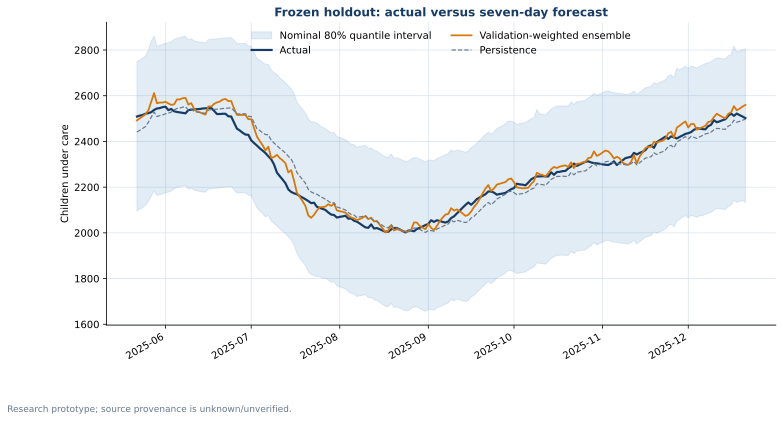
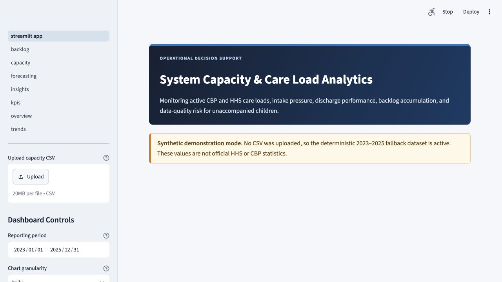
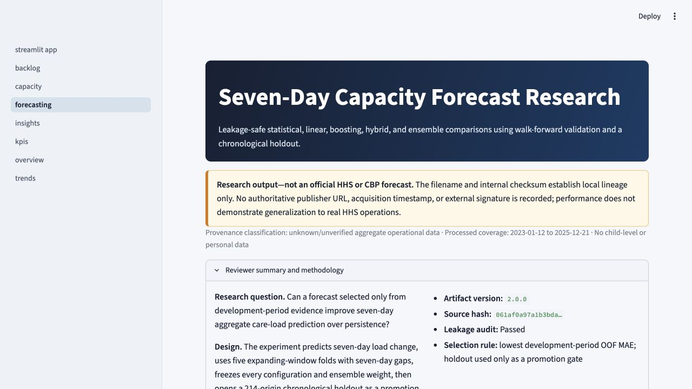
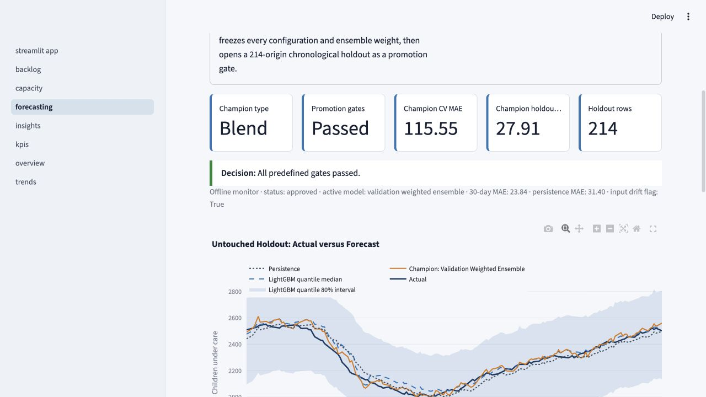
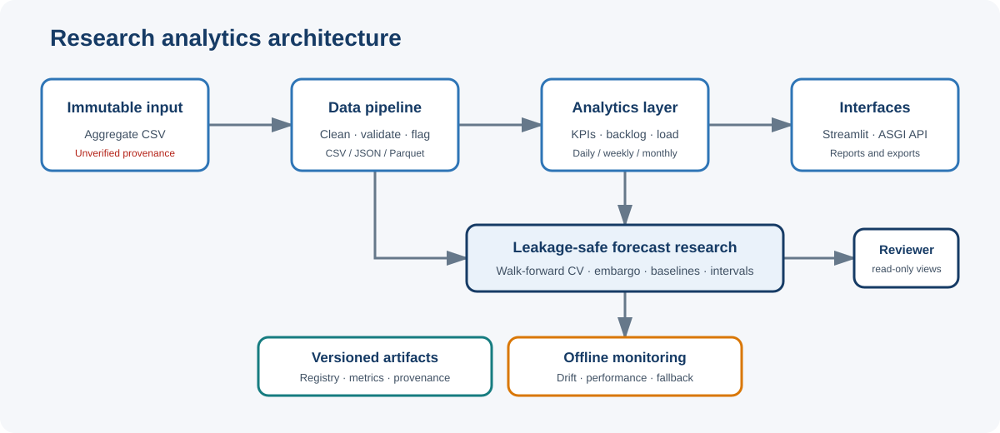
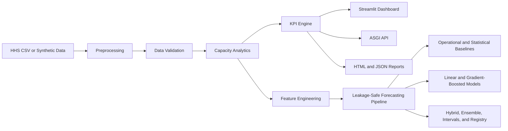

# System Capacity & Care Load Analytics for Unaccompanied Children


[](https://github.com/ananyadas1803git/system-capacity-and-careload-analytics-for-unaccompanied-children/actions/workflows/ci.yml)

An end-to-end data engineering and analytics application for monitoring system capacity, care load, intake pressure, discharge performance, and backlog accumulation for unaccompanied children in CBP and HHS care.

The project combines a production-style Python analytics backend, data-quality validation, feature engineering, KPI calculation, report generation, a multipage Streamlit dashboard, and an ASGI API.

> **Important:** This project is an independent research and decision-support prototype. It is not an official HHS or CBP application, forecast, publication, or operational system.

## Research Questions

1. Can a model selected only from development-period evidence improve seven-day aggregate care-load forecasts over persistence?
2. Does that improvement hold across expanding-window folds and an untouched chronological holdout?
3. How does forecast error change across load, pressure, calendar, and data-quality regimes?

## Key Findings

- A development-selected ensemble (60% seven-day drift, 40% CatBoost) reduced walk-forward MAE from 188.139 for persistence to 115.547.
- It passed the frozen-holdout gate with MAE 27.906 versus 37.547 for persistence, a 25.676% improvement.
- Seven-day drift achieved a slightly lower holdout MAE of 26.869, but it did not replace the champion after holdout inspection; this preserves the predefined research protocol.
- Error was larger in high-load and moderate net-intake regimes. Nominal-80% holdout intervals covered 100% with mean width 655.45, indicating conservative uncertainty.
- These findings apply only to the included **unknown/unverified** aggregate source and do not establish real HHS operational validity.



[Data card](DATA_CARD.md) · [Model card](MODEL_CARD.md) · [Research report](reports/research_report.md) · [Reproducibility](REPRODUCIBILITY.md) · [Ethical use](docs/ETHICAL_USE.md)

## Quick Start

```bash
git clone https://github.com/ananyadas1803git/system-capacity-and-careload-analytics-for-unaccompanied-children.git
cd system-capacity-and-careload-analytics-for-unaccompanied-children
conda env create -f environment.yml
conda activate hhs-uac-analytics
python main.py pipeline --quick --output-dir output/quick_pipeline --force
python main.py dashboard
```

Open `http://127.0.0.1:8501` after Streamlit starts. The quick pipeline uses a
deterministic synthetic fixture and does not overwrite the approved forecasting
artifacts.

## Repository Guide

- [Installation](#installation)
- [Run the dashboard](#running-the-dashboard)
- [Run the API](#running-the-api)
- [Command-line workflows](#command-line-workflows)
- [Forecasting methodology and results](#seven-day-multi-model-forecasting)
- [Data quality](#data-quality-findings)
- [Reproduce and verify](#verification-status)
- [Deployment](#deployment)

## Dashboard Preview

| Capacity overview | Forecast methodology and provenance |
|---|---|
|  |  |



---

## Problem Statement

Daily transfers, discharges, and active-care populations interact across the CBP and HHS care systems. Reviewing individual daily counts alone makes it difficult to identify:

- Increasing system pressure
- Persistent intake backlogs
- Changes in discharge performance
- Care-load volatility
- Capacity utilization risk
- Data-quality problems
- Long-term and seasonal patterns

This project transforms daily aggregate counts into validated, decision-support metrics and interactive analytical views.

---

## Key Features

### Data engineering

- CSV ingestion with schema validation
- Automatic date parsing and chronological ordering
- Missing-date detection and daily-series reconstruction
- Missing-value imputation with audit flags
- Duplicate, negative-value, and logical-anomaly detection
- Reproducible raw and processed data artifacts
- CSV, JSON, and Parquet output formats

### Capacity analytics

- Total System Load
- Net Daily Intake
- Care Load Growth Rate
- 7-day and 14-day moving averages
- Discharge Offset Ratio
- Backlog streak and episode detection
- CBP and HHS care-load comparison
- Capacity utilization and headroom scenarios
- Daily, weekly, and monthly aggregation

### Dashboard

- Professional slate/navy government-analytics theme
- Configurable reporting period
- Daily, weekly, and monthly chart granularity
- CSV file upload
- Deterministic synthetic-data fallback
- KPI scorecards
- Interactive Plotly visualizations
- Data-quality and anomaly logs
- Downloadable analytical reports

### Backend and research tooling

- Starlette-based ASGI API
- Unified command-line interface
- Feature engineering for forecasting
- Leakage-aware chronological dataset splitting
- Statistical, linear, gradient-boosting, hybrid, and ensemble forecasting
- Five-fold expanding-window model selection with a seven-day embargo
- Structured logging and audit utilities
- HTML and JSON stakeholder reports
- Seven research notebooks
- Preserved legacy ridge and LightGBM artifacts

---

## System Architecture





---

## Core KPIs

| KPI | Definition |
|---|---|
| Total Children Under Care | Latest CBP custody plus HHS care population |
| Net Intake Pressure | Transfers from CBP minus discharges from HHS |
| Care Load Volatility Index | Standard deviation of daily system-load growth |
| Backlog Accumulation Rate | Longest consecutive period with positive net intake |
| Discharge Offset Ratio | HHS discharges divided by CBP transfers plus one |

Additional analytical fields include rolling averages, active backlog streaks, anomaly indicators, capacity utilization, system headroom, and backlog episodes.

---

## Input Dataset Schema

The expected CSV contains the following columns:

| Column | Description |
|---|---|
| `Date` | Reporting date |
| `Children apprehended and placed in CBP custody` | Daily intake volume |
| `Children in CBP custody` | Active CBP care load |
| `Children transferred out of CBP custody` | Daily transfers into the HHS system |
| `Children in HHS Care` | Active HHS care load |
| `Children discharged from HHS Care` | Daily sponsor placements or other discharges |

All data used by this project contains aggregate operational counts. It does not contain child-level records or personally identifiable information.

---

## Project Structure

```text
.
├── app/
│   ├── streamlit_app.py
│   └── pages/
│       ├── overview.py
│       ├── backlog.py
│       ├── capacity.py
│       ├── insights.py
│       ├── kpis.py
│       ├── trends.py
│       └── forecasting.py
├── backend/
│   ├── analytics.py
│   ├── api.py
│   └── utils.py
├── src/
│   ├── feature_engineering.py
│   ├── forecasting.py
│   ├── kpi.py
│   ├── lightgbm_forecasting.py
│   ├── logger.py
│   ├── monitoring.py
│   ├── pipeline.py
│   ├── preprocessor.py
│   ├── report_generator.py
│   ├── validation.py
│   └── visualisation.py
├── data/
│   ├── raw/
│   └── processed/
├── notebooks/
├── output/
│   ├── charts/
│   ├── exports/
│   ├── logs/
│   ├── models/
│   └── forecasting/
├── reports/
├── scripts/
│   └── generate_reviewer_assets.py
├── tests/
│   ├── test_forecasting_framework.py
│   ├── test_lightgbm_forecasting.py
│   ├── test_model_api.py
│   └── test_pipeline_monitoring.py
├── .github/workflows/ci.yml
├── Dockerfile
├── docker-compose.yml
├── environment.yml
├── pyproject.toml
├── .gitignore
├── app_utils.py
├── generate_sample_data.py
├── main.py
├── requirements.txt
└── requirements-dev.txt
```

---

## Installation

### 1. Clone the repository

```bash
git clone https://github.com/ananyadas1803git/system-capacity-and-careload-analytics-for-unaccompanied-children.git
cd system-capacity-and-careload-analytics-for-unaccompanied-children
```

### 2. Create a virtual environment

```bash
python3.13 -m venv .venv
```

Activate it on macOS or Linux:

```bash
source .venv/bin/activate
```

Activate it on Windows:

```powershell
.venv\Scripts\activate
```

### 3. Install the dependencies

```bash
python -m pip install --upgrade pip
python -m pip install -r requirements.txt
```

Anaconda users can create the verified Python 3.13 environment instead:

```bash
conda env create -f environment.yml
conda activate hhs-uac-analytics
```

For tests, linting, pre-commit, and reviewer-asset generation:

```bash
python -m pip install -r requirements-dev.txt
pre-commit install
```

## Fast Reproducible Check

```bash
python main.py pipeline --quick --output-dir output/quick_pipeline --force
python main.py pipeline
python main.py monitor-model --no-write
```

Quick mode is a deterministic synthetic software smoke test. The default pipeline regenerates data stages and verifies approved artifacts without training. Full retraining is always explicit.

---

## Running the Dashboard

From the repository root:

```bash
python main.py
```

The dashboard will be available at:

```text
http://127.0.0.1:8501
```

The explicit dashboard command is:

```bash
python main.py dashboard
```

Streamlit can also be started directly:

```bash
python -m streamlit run app/streamlit_app.py
```

If no CSV is uploaded, the application automatically uses a deterministic synthetic dataset covering January 1, 2023 through December 31, 2025.

---

## Running the API

Start the development API server:

```bash
python main.py api --reload
```

The API will be available at:

```text
http://127.0.0.1:8000
```

### API endpoints

| Method | Endpoint | Purpose |
|---|---|---|
| `GET` | `/` | Service discovery |
| `GET` | `/health` | Health check |
| `GET` | `/api/v1/schema` | Input and output schema |
| `GET` | `/api/v1/mock-data` | Paginated synthetic records |
| `GET` | `/api/v1/mock-analysis` | Synthetic-data analytics |
| `POST` | `/api/v1/analyze` | Analyze JSON records |
| `POST` | `/api/v1/analyze/csv` | Analyze a CSV request body |
| `POST` | `/api/v1/capacity-scenario` | Evaluate planning-capacity scenarios |
| `GET` | `/api/v1/model` | Approved model registry and promotion metadata |
| `GET` | `/api/v1/model/metrics` | Frozen evaluation and error-regime metrics |
| `GET` | `/api/v1/model/provenance` | Dataset lineage, hashes, and leakage audit |
| `GET` | `/api/v1/model/monitoring` | Offline performance, drift, and fallback status |
| `GET` | `/api/v1/forecast` | Frozen champion holdout forecast by optional `as_of` date |

Example health check:

```bash
curl http://127.0.0.1:8000/health
```

Example mock analysis:

```bash
curl "http://127.0.0.1:8000/api/v1/mock-analysis?granularity=Monthly"
```

---

## Command-Line Workflows

Display every available command:

```bash
python main.py --help
```

Validate the included dataset:

```bash
python main.py validate
```

Validate synthetic data:

```bash
python main.py validate --mock
```

Run headless analytics:

```bash
python main.py analyze
```

Run weekly analytics using synthetic data:

```bash
python main.py analyze --mock --granularity Weekly
```

Generate an HTML report:

```bash
python main.py report --mock --format html
```

Regenerate data artifacts:

```bash
python main.py generate-data
```

---

## Seven-Day Multi-Model Forecasting

The research framework predicts the seven-day **change** in Total System Load
and reconstructs the absolute load from information known at the forecast origin:

```text
target_change_7d = target_total_load_t_plus_7d - current_total_system_load
final_forecast = current_total_system_load + predicted_change_7d
```

This target reduces the burden of learning the absolute level while preserving
the origin-known current load as an explicit anchor. The original absolute
target remains in the processed artifact for compatibility.

Run the complete experiment from the repository root:

```bash
python main.py train-models
```

The unified reproducible command is:

```bash
python main.py pipeline
```

It verifies the raw-to-feature lineage and approved model artifacts without fitting. Deliberate full retraining uses:

```bash
python main.py pipeline --train --force
```

Regenerate only the dedicated multi-model artifacts intentionally with:

```bash
python main.py train-models --force
```

Inspect existing metrics without training:

```bash
python main.py evaluate-models
```

The legacy `python main.py train-lightgbm` command and all original ridge and
LightGBM files remain available and unchanged.

### Data provenance and limitations

The modeling source is classified as **unknown/unverified aggregate operational
data**, not confirmed real HHS data. The repository proves local lineage between
the supplied raw CSV and processed artifacts with a matching SHA-256, but it has
no authoritative publisher URL, acquisition timestamp, or external signature.
Accordingly, these results do not demonstrate generalization to real HHS
operations. The source contains daily aggregate counts only and no child-level
or personal data.

Processed coverage is 2023-01-12 through 2025-12-21: 1,075 daily rows after 355
dates were inserted and 1,775 numeric values were imputed. The stock-flow audit
found a median absolute reconciliation error of 47 children and only 26.07% of
days within 10 children, so the optional structural-flow forecast was skipped.

### Validation strategy

- 847 observations from 2023-01-12 through 2025-05-07 form the development set.
- Five expanding-window folds use equal 56-day validation periods and a seven-day gap.
- Seven additional observations are embargoed before the final holdout.
- The untouched 214-row holdout covers 2025-05-15 through 2025-12-14 forecast origins.
- Feature groups, hyperparameters, residual-corrector choice, conformal
  calibration, and ensemble weights use development data only.
- Each fold independently fits median imputation, near-constant removal, and
  correlation filtering; the final selected compact set contains 42 features.
- The holdout is evaluated only after every configuration and ensemble weight is frozen.

### Leakage controls

- Every target, lead, and future-derived column is excluded from model inputs.
- Same-day transfers, discharges, and apprehensions are excluded; their signals
  enter only through lags and shifted historical summaries.
- Current Total System Load is available at origin close and is used as a feature
  and reconstruction anchor.
- Feature availability and exclusion reasons are saved explicitly.
- Fold preprocessing is fit on training rows only.
- SARIMAX residual corrections use development-period out-of-fold residuals,
  never in-sample residuals.
- Ensemble weights are non-negative, sum to one, and are chosen only from OOF predictions.
- Data, schema, source, configuration, and library versions are fingerprinted.

### Models evaluated

The common framework evaluates persistence, seven-day drift, ridge, Elastic
Net, ETS/Holt-Winters, SARIMAX, LightGBM, CatBoost, XGBoost, a
SARIMAX-plus-CatBoost OOF-residual hybrid, and a validation-weighted ensemble.
Small CPU-friendly searches use fixed seeds and early stopping where supported.

### Actual evaluation results

These values are read directly from the generated artifacts.

| Model | CV MAE | CV SD | Worst fold | Holdout MAE | RMSE | MASE | Improvement vs persistence |
|---|---:|---:|---:|---:|---:|---:|---:|
| Persistence | 188.139 | 137.721 | 362.732 | 37.547 | 46.855 | 1.000 | 0.000% |
| Seven-day drift | 132.004 | 70.873 | 237.625 | **26.869** | **32.780** | 0.716 | +28.438% |
| Ridge | 261.521 | 134.478 | 412.376 | 88.894 | 101.592 | 2.368 | -136.756% |
| Elastic Net | 282.108 | 150.752 | 487.894 | 89.856 | 102.910 | 2.393 | -139.317% |
| ETS/Holt-Winters | 222.353 | 97.057 | 361.614 | 72.374 | 86.138 | 1.928 | -92.757% |
| SARIMAX | 216.453 | 95.289 | 367.039 | 102.596 | 111.947 | 2.732 | -173.248% |
| LightGBM | 157.927 | 113.208 | 348.445 | 32.834 | 42.350 | 0.874 | +12.552% |
| CatBoost | 148.289 | 106.765 | 330.291 | 45.348 | 55.380 | 1.208 | -20.777% |
| XGBoost | 166.646 | 123.234 | 374.019 | 35.834 | 47.353 | 0.954 | +4.561% |
| SARIMAX + CatBoost residual hybrid | 264.994 | 217.408 | 572.091 | 111.988 | 122.171 | 2.983 | -198.262% |
| Validation-weighted ensemble | **115.547** | **59.219** | **194.970** | 27.906 | 35.441 | **0.743** | **+25.676%** |

The ensemble was selected using development OOF MAE and frozen at 60% seven-day
drift plus 40% CatBoost; a zero-weight LightGBM candidate was removed. It beat
persistence in three of five folds, had a lower worst-fold error, and beat
persistence on the untouched holdout. **Promotion decision: promote the
validation-weighted ensemble.** Seven-day drift happened to have a slightly
lower holdout MAE, but it was not selected after looking at the holdout; the
development-selected ensemble remains the honest champion under the predefined rules.

### Prediction intervals

LightGBM quantile models generate 10th, 50th, and 90th percentile forecasts.
Raw walk-forward coverage was 85.36%; a development-only split-conformal check
covered 100.00% of its 56-row calibration-evaluation tail. Final holdout coverage
was 100.00% with a mean width of 655.45 children. The raw crossing rate was 0%
for both development and holdout. These intervals are conservative and should
not be interpreted as validated operational uncertainty bounds.

### Forecasting artifacts

| Artifact | Location |
|---|---|
| Canonical prepared training frame | `output/forecasting/audits/canonical_prepared_forecast_frame.parquet` |
| Model registry and serialized candidates | `output/forecasting/models/` |
| Model comparison, folds, intervals, and promotion | `output/forecasting/metrics/` |
| Development OOF and final holdout predictions | `output/forecasting/predictions/` |
| Provenance, feature availability, and leakage audits | `output/forecasting/audits/` |
| Residual, regime, correlation, and importance diagnostics | `output/forecasting/diagnostics/` |
| Standalone interactive research report | `output/forecasting/forecast_model_report.html` |

The original ridge and single-model LightGBM artifacts under `output/models/`
and `output/exports/` are preserved for benchmark reproducibility.

---

## Research Notebooks

The notebooks provide a reproducible analytical workflow:

1. Data-quality audit
2. Exploratory capacity analysis
3. Backlog-pressure analysis
4. Feature engineering
5. Capacity forecasting
6. Model evaluation
7. Multi-model forecasting artifact analysis

Reusable project logic remains in `src/`, while notebooks focus on research, experimentation, and interpretation.

---

## Data-Quality Findings

The supplied HHS CSV is retained as an unchanged raw input. Strict validation identifies source-quality issues including:

- Empty export-padding rows
- Nonchronological records
- Missing calendar dates
- Transfers exceeding recorded active CBP custody on some dates
- Statistical outliers requiring source verification

These findings are preserved in the generated validation and preprocessing reports. The processing pipeline does not silently represent repaired or imputed values as untouched source observations.

The synthetic dataset passes the complete validation workflow and is intended for demonstration and application testing.

---

## Verification Status

The following components have been tested successfully:

- Python compilation
- Static linting
- Dependency consistency
- Main Streamlit dashboard
- Seven specialist Streamlit pages, including precomputed forecast research
- Synthetic-data validation
- Real and synthetic analytics
- Data artifact generation
- HTML and JSON report generation
- All ASGI API endpoints
- Forty-four focused forecasting, orchestration, monitoring, and API tests
- Deterministic LightGBM and multi-model training with artifact generation

Run the forecasting tests with:

```bash
python -m unittest discover -s tests -v
```

CI runs Ruff lint/format checks, the full test suite, quick end-to-end orchestration, approved-artifact verification, and monitoring on every pull request and push to `main` or `master`.

For the complete reproducibility protocol, dependency assumptions, artifact
lineage, and known platform constraints, see [REPRODUCIBILITY.md](REPRODUCIBILITY.md).

---

## Deployment

Local containers:

```bash
docker compose up --build
```

The dashboard is available on port 8501 and the API on port 8000. The repository is also configured for Streamlit Community Cloud with `app/streamlit_app.py` as the entry point. No live deployment is claimed. See [docs/DEPLOYMENT.md](docs/DEPLOYMENT.md) for the complete checklist.

---

## Ethical and Operational Considerations

This project concerns a vulnerable population and should be interpreted carefully.

- No individual-level child records are used.
- Synthetic data must not be represented as official HHS or CBP data.
- Model outputs are research benchmarks, not official forecasts.
- KPI alerts are decision-support indicators, not automated operational decisions.
- Material findings should be verified against authoritative HHS and CBP sources.
- Statistical relationships should not be interpreted as causal conclusions.

---

## Future Enhancements

- Configurable capacity thresholds
- Better-calibrated probabilistic intervals and regime-aware forecasting
- Role-based dashboard access
- Cloud-based scheduled ingestion
- External experiment tracking and signed artifact storage

---

## Author

**Ananya Das**

Computer Science and Engineering student focused on end-to-end data engineering, machine learning, analytics, and deployable research projects.

GitHub: [@ananyadas1803git](https://github.com/ananyadas1803git)

## Contributing, Security, and Citation

- Contribution workflow: [CONTRIBUTING.md](CONTRIBUTING.md)
- Responsible vulnerability reporting: [SECURITY.md](SECURITY.md)
- Citation metadata: [CITATION.cff](CITATION.cff)
- Release history: [CHANGELOG.md](CHANGELOG.md)

No open-source license has currently been selected. Unless a license is added,
the repository's source code and assets should not be assumed to grant reuse,
modification, or redistribution rights.

---

## Disclaimer

This repository is intended for educational, research, and portfolio purposes. It is not affiliated with, endorsed by, or operated by the U.S. Department of Health and Human Services, U.S. Customs and Border Protection, or any other government agency.
